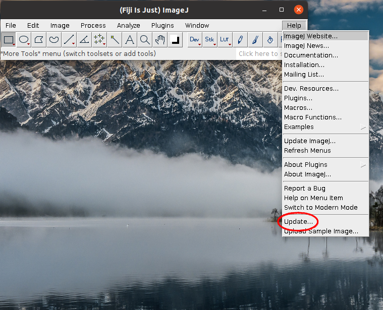
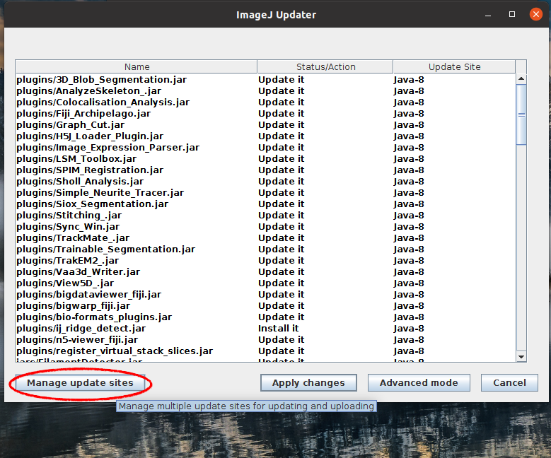
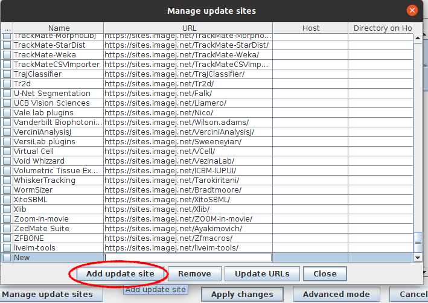
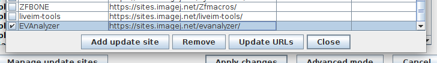
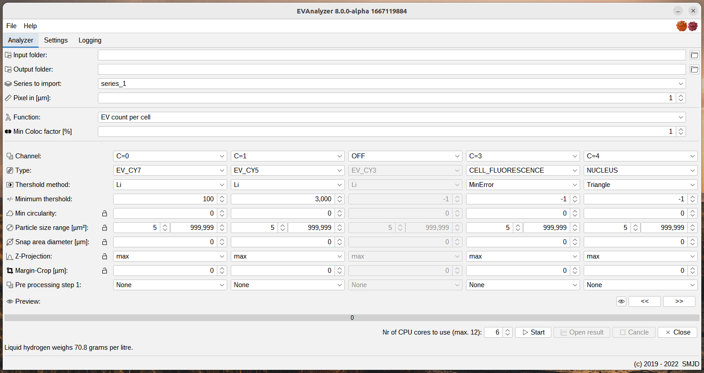

# EVAnalyzer

## Description
EVAnalyzer is a Fiji ImageJ plugin designed for analyzing microscope pictures of EVs. This plugin can be used for:
*  Counting the number of EVs.
*  Calculating the colocalization of evs and other particles.
*  Detect biological cells and counting EVs updatekn from cells.
*  Analysis of a large amount of images automatically.
*  Generating XLSX (Excel) reports with automatic statistics generation.


## Installation
*  Download and instal Fiji from [Fiji](https://imagej.net/Fiji/Downloads).
*  Add EVAnalyzer to update sites:
  1.  Open Fiji
  2.  Click `Help -> Update`
  
  3.  Click `Manage update sites`
  
  4.  Click `Add update site`
    
  5. Look `EVAnalayzer` in the update site list or enter `EVAnalayzer` in name field and `https://sites.imagej.net/evanalyzer/` in the URL field
    
  6. Restart Fiji


## Roadmap

- [ ] Make it possible to automatically generate reports for 10'000 and more images per run.
- [ ] Export of `R` files and automatic diagram generation.
- [ ] Implement automatic unit test as positive and negative control reference to be sure that an update does not influence future analysis results.
- [ ] Improve preview functionaltity to be more detailed.
- [ ] Extend to support more than 5 channels.
- [ ] Include handbook and Help functionality directly from the PlugIn.


## Contributing

If you have some questions, feature requests or if you found a bug, please just create an issue in the Issues tab.

## Coding

For development Visual Studio Code is used. Compiling is done within a docker image (dev container).
*  Download and install [Visual Studio Code](https://code.visualstudio.com/)
*  Install ```Remote Container``` plugin.
*  Clone the repository and open the cloned folder in Visual Studio Code.
*  Reopen the project in Dev Container.
*  Run ```./build.sh``` to compile the project.


## Common issues
*  Images used in the plugin cannot be in the RGB format, and must be monochromatic.
*  Actually VSI, TIF and CZI images can be processed.

## Screenshot


