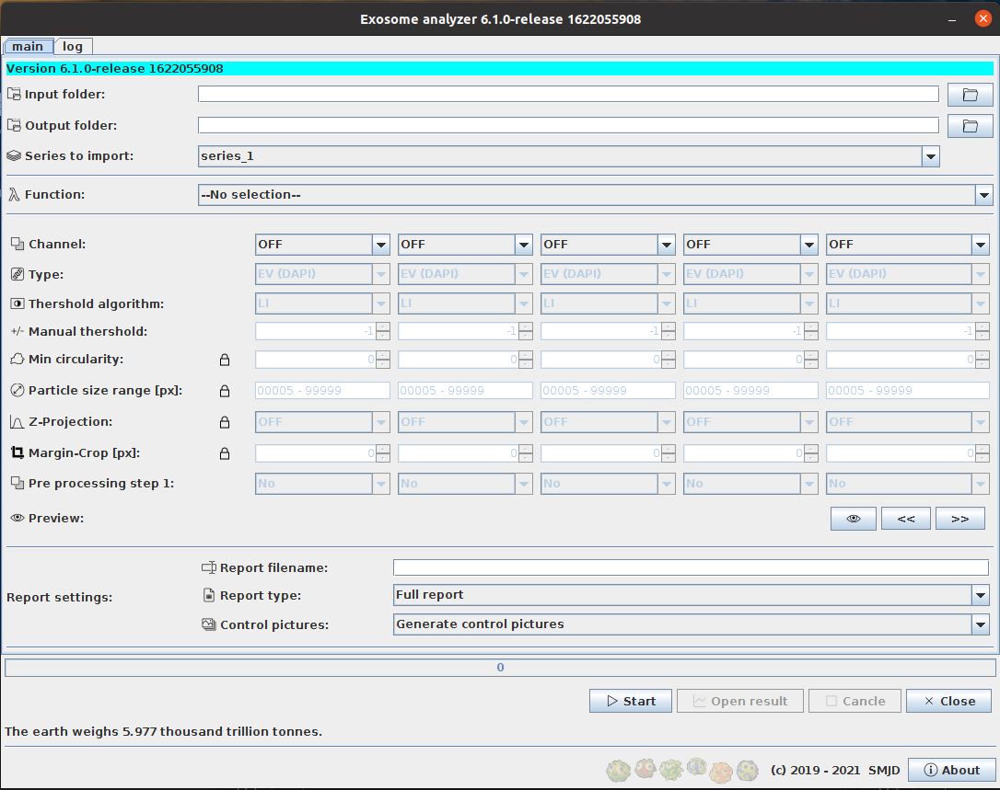

# EVAnalyzer

## Description
EVAnalyzer is a Fiji ImageJ plugin designed for analyzing microscope pictures of EVs. This plugin can be used for:
*  Counting the number of EVs.
*  Calculating the colocalization of evs and other particles.
*  Detect biological cells and counting EVs updatekn from cells.
*  Analysis of a large amount of images automatically.
*  Generating XLSX (Excel) reports with automatic statistics generation.


## Installation
*  Download and instal Fiji from [Fiji](https://imagej.net/Fiji/Downloads).
*  Copy the file ```EVAnalyzer.jar``` to the folder ```Plugins``` of your Fiji installation.
*  Copy the content of the [jars.zip](https://github.com/joda01/evanalyzer/raw/master/bin/jars.zip) folder in the ```jars``` folder of your Fiji installation.
*  Restart Fiji.
*  You will find the plugin the menu: Plugins -> Analyze -> Exosoms


## Contributing
For development Visual Studio Code is used. Compiling is done within a docker image (dev container).
*  Download and install [Visual Studio Code](https://code.visualstudio.com/)
*  Install ```Remote Container``` plugin.
*  Clone the repository and open the cloned folder in Visual Studio Code.
*  Reopen the project in Dev Container.
*  Run ```./src/build.sh``` to compile the project.


## Common issues
*  Images used in the plugin cannot be in the RGB format, and must be monochromatic.
*  Actually only VSI images can be processed.

## Screenshot


